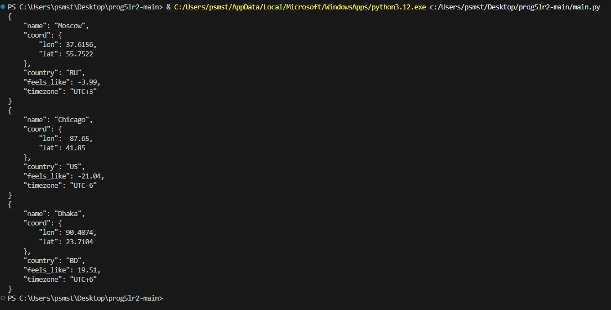

# openweatherapi

## Описание задачи
Написать реализацию функции  ```get_weather_data(place, api_key=None)``` (в модуле ```getweatherdata```), в которой необходимо получить данные о погоде с сайта https://openweathermap.org/. 

Функция должна возвращать объект в формате JSON, включающий: 
- информацию о названии города (в контексте openweathermap),
- код страны (2 символа),
- широту и долготу, на которой он находится,
- его временной зоне,
- а также о значении температуры (как она ощущается).

Значение временной зоны выводить в формате UTC±N, где N - цифра временного сдвига.
Протестировать выполнение программы со следующими городами: Чикаго, СПб, Дакка.

Результат работы:


